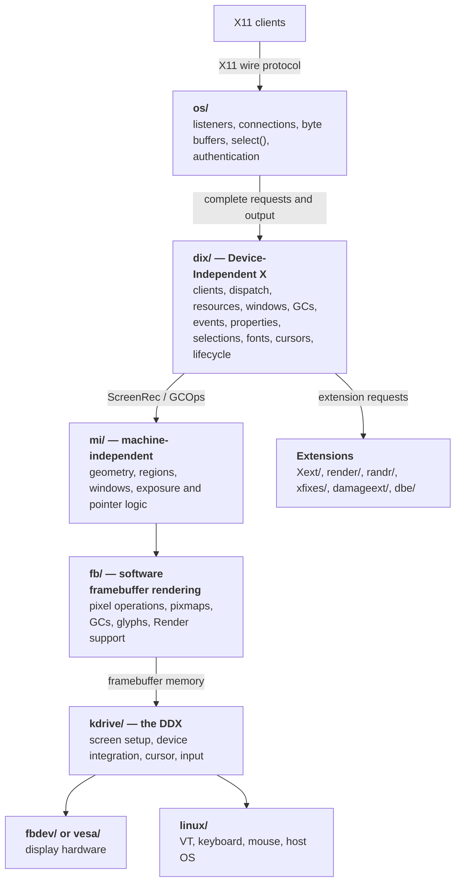
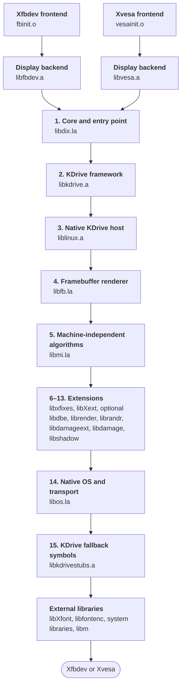
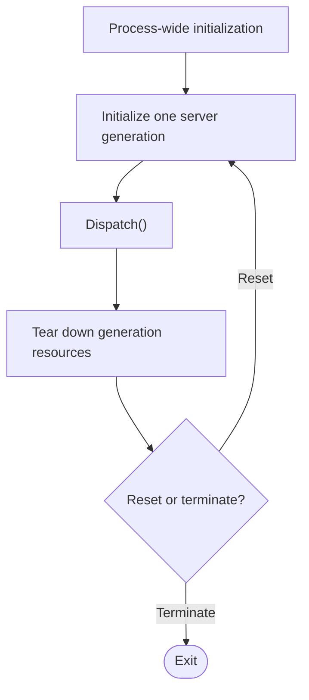
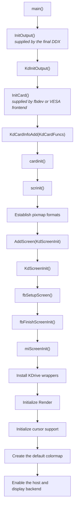
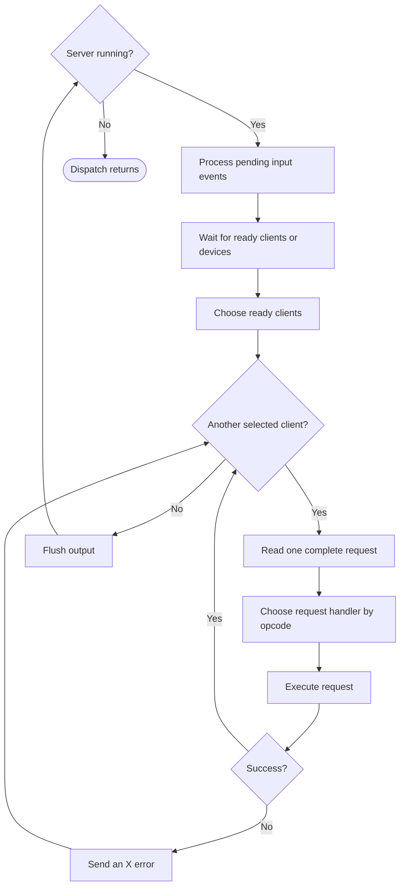
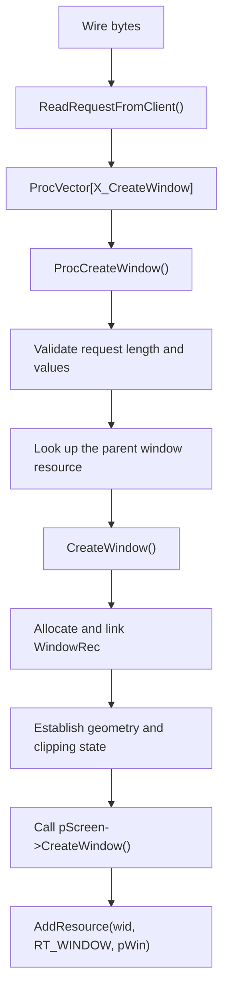
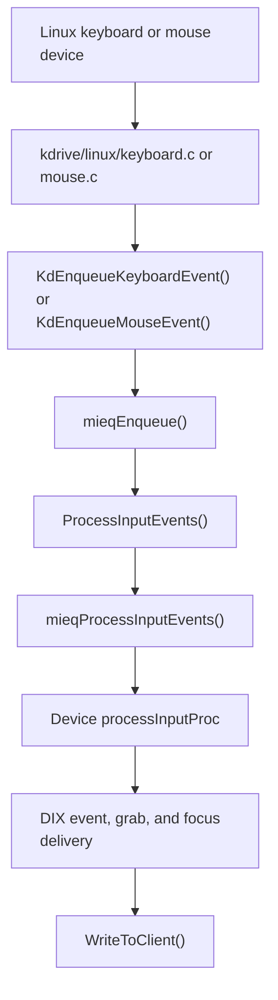
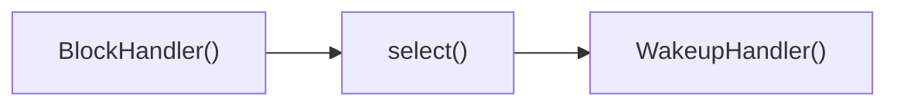

# A Guided Tour of the TinyX Architecture

TinyX is not a small X implementation written from scratch. It is a compact
configuration of the traditional X server architecture, using KDrive as its
DDX and either Linux framebuffer or VESA hardware as its display backend.
Consequently, the source uses terminology and layering inherited from the
XFree86/Xorg server.

This document describes the architecture that exists today. It is intended as
a map for reading the code, not as a proposal for how the server should be
rewritten.

## 1. The server in one picture

At a high level, an X server accepts byte streams from clients, decodes X11
requests, mutates server-side objects, renders into screens, and sends replies
and events back to clients.



The boundaries are not perfectly clean. In particular, `dix/main.c` owns the
process entry point, while `os/` combines generic server scheduling with a
concrete Unix transport implementation. Nevertheless, the traditional layers
are visible throughout the code.

## 2. Vocabulary: DIX, DDX, MI, and FB

These names appear frequently in filenames, comments, symbols, and headers.

### DIX: Device-Independent X

`dix/` implements the core semantics of an X server. It understands X11
clients and resources but delegates screen operations through function
pointers.

Important responsibilities include:

- decoding core protocol requests;
- maintaining clients and their state;
- managing XIDs and resources;
- maintaining the window tree;
- event selection, propagation, grabs, and focus;
- graphics contexts, pixmaps, colormaps, cursors, and fonts;
- extension registration;
- server startup, reset, and shutdown.

“Device-independent” does not mean “platform-independent library” in the
modern sense. DIX still calls externally supplied DDX hooks and depends on the
OS layer.

### DDX: Device-Dependent X

The DDX adapts the generic X server to a display and input environment. TinyX
uses KDrive as its shared DDX framework. The final device backends are:

- `kdrive/fbdev/` for Linux `/dev/fb*` devices;
- `kdrive/vesa/` for VESA hardware.

The DDX supplies global entry points expected by DIX, including `InitOutput`,
`InitInput`, `ddxProcessArgument`, and `ddxUseMsg`.

### MI: Machine Independent

`mi/` contains reusable implementations of screen and drawing algorithms:
regions, arcs, polygons, lines, window validation, exposure handling, pointer
tracking, software cursors, and the machine-independent input queue.

MI generally operates through `ScreenRec` and `GCPtr` callbacks rather than
knowing how pixels reach physical hardware.

### FB: Framebuffer

`fb/` is a software rasterization backend. It implements screen, pixmap,
window, GC, glyph, and Render operations against framebuffer memory.

This is distinct from `kdrive/fbdev/`:

- `fb/` draws pixels into memory;
- `kdrive/fbdev/` opens and maps a Linux framebuffer device and describes that
  memory to KDrive and FB.

That distinction is central to understanding why much of the rendering stack
is already independent of Linux framebuffer devices.

## 3. The source tree by responsibility

| Path | Responsibility |
|---|---|
| `dix/` | Core server state and X11 protocol semantics |
| `include/` | Internal server interfaces and object definitions |
| `os/` | Unix process setup, Xtrans connections, I/O, auth, timers, waiting |
| `mi/` | Generic rendering, regions, windows, pointer, and event queue logic |
| `fb/` | Software framebuffer renderer |
| `kdrive/src/` | Shared compact DDX implementation |
| `kdrive/linux/` | Linux VT, keyboard, mouse, and OS integration |
| `kdrive/fbdev/` | Linux framebuffer display backend and `Xfbdev` frontend |
| `kdrive/vesa/` | VESA display backend and `Xvesa` frontend |
| `miext/damage/` | Internal drawable damage tracking |
| `miext/shadow/` | Shadow framebuffer and rotation support |
| `Xext/` | Traditional protocol extensions such as SHAPE and BIG-REQUESTS |
| `render/` | RENDER extension and software picture composition |
| `randr/` | RANDR extension |
| `xfixes/` | XFIXES extension |
| `damageext/` | DAMAGE protocol extension |
| `dbe/` | DOUBLE-BUFFER extension |

The headers in `include/` are not a public SDK. They expose shared internal
structures and interfaces used across these components.

### Compile and link dependency graph

TinyX does **not** compile every source file as one translation unit. Automake
compiles each `.c` file separately, then groups the resulting objects into
internal archives. Most subsystems use Libtool convenience libraries (`.la`),
while KDrive and its hardware and host backends use ordinary static archives
(`.a`). `AC_DISABLE_SHARED` disables shared-library output, and none of these
internal libraries is installed.

The subsystem archives do not link to one another when they are created.
Instead, `configure.ac` flattens them into `KDRIVE_LIBS`, and the final
`Xfbdev` or `Xvesa` link resolves references across the complete ordered list.
The following graph shows that final link order. Follow either frontend path
from top to bottom; the two paths share everything beginning with `libdix.la`.



The numbered part is the value of `KDRIVE_LIBS` assembled in `configure.ac`:

```text
libdix.la
libkdrive.a
liblinux.a
libfb.la
libmi.la
libxfixes.la
libXext.la
libdbe.la             (when DBE is enabled)
librender.la
librandr.la
libdamageext.la
libdamage.la
libshadow.la
libos.la
libkdrivestubs.a
```

This ordering is significant for a traditional static linker: a library that
contains unresolved references generally appears before the library expected
to satisfy them. For example, `libdix.la` contains `main()` and references DDX
and OS functions supplied later, while the selected frontend object supplies
`InitOutput()`, `InitInput()`, and other DDX hooks before `libdix.la` is
searched. `libkdrivestubs.a` deliberately comes near the end to provide
fallback implementations only when no earlier archive supplied them.

This graph is a **link graph**, not a clean semantic dependency DAG. The code
uses callbacks, wrappers, required global symbols, and shared globals in both
directions. DIX calls down through `ScreenRec`, while FB, MI, KDrive, and
extensions also call services back in DIX. The archive order is therefore a
better description of how the present build is assembled than a claim that
each source directory forms a strictly lower layer.

When the compiler accepts `-flto`, `configure` enables link-time optimization.
The source files are still compiled separately and placed in the archives;
the final link may then optimize the selected LTO objects as a whole program.
Without LTO, the same archive structure and ordering remain in effect.

For an archive-by-archive account of these layers and the external packages
they pull in, see [TinyX, Layer by Layer](layers.md). For a source-level
dependency graph and an analysis of the input, display, and protocol seams,
see [Finding the Embedding Boundaries](embedding-boundaries.md). The
mechanically generated object and archive dependency reports are documented in
[Auditing TinyX Symbol Dependencies](symbol-dependencies.md).

## 4. The central object model

The server is built around a small number of large C structures connected by
pointers and function tables.

### `ScreenInfo` and `ScreenRec`

The global `screenInfo` in `dix/globals.c` describes the server's image formats
and installed screens:

```c
typedef struct _ScreenInfo {
    int imageByteOrder;
    int bitmapScanlineUnit;
    int bitmapScanlinePad;
    int bitmapBitOrder;
    int numPixmapFormats;
    PixmapFormatRec formats[MAXFORMATS];
    int numScreens;
    ScreenPtr screens[MAXSCREENS];
} ScreenInfo;
```

Each `ScreenRec` contains screen properties and a large virtual function table.
Among other things, it provides callbacks for:

- window creation, mapping, painting, validation, and exposure;
- pixmap creation and destruction;
- image and span access;
- GC creation;
- cursor operations;
- fonts and colormaps;
- block and wakeup handling;
- screen resource creation and shutdown.

`ScreenRec` is one of the main architectural seams. DIX calls its operations;
MI, FB, KDrive, and extensions install or wrap those operations.

### Drawables, windows, and pixmaps

A drawable is anything that can be a rendering source or destination. Windows
and pixmaps begin with a `DrawableRec`, allowing code to accept a
`DrawablePtr` and inspect its type, depth, dimensions, ID, and screen.

A `WindowRec` additionally stores:

- parent, child, and sibling links;
- geometry and origin;
- clipping and border regions;
- background and border state;
- mapping and visibility state;
- selected event masks;
- optional properties, cursor, colormap, grabs, and shape regions.

The root window for each screen is stored in the global `WindowTable[]`.
Windows form a tree beneath it.

A pixmap is an off-screen drawable. FB also uses a pixmap to represent the
screen's backing memory, allowing many window and pixmap operations to share
the same rasterization code.

### Graphics contexts

A graphics context (`GC`) holds drawing state: foreground and background
pixels, raster operation, plane mask, line and fill styles, font, tile,
stipple, clipping, and related values.

A GC contains two tables:

- `GCFuncs` manages GC state and clipping;
- `GCOps` performs drawing operations such as `FillSpans`, `PutImage`,
  `CopyArea`, lines, polygons, rectangles, arcs, text, and glyph blits.

DIX validates protocol arguments and manages GC lifetime. The screen's
`CreateGC` callback supplies the implementation, normally FB in this tree.

### Clients

`ClientRec`, defined in `include/dixstruct.h`, represents one X11 client. It
contains:

- a numeric client index and XID prefix;
- the current request buffer and request length;
- byte-order state;
- sequence and error state;
- a pointer to OS/transport-private state;
- resource and save-set state;
- the active request dispatch vector;
- cached drawable and GC lookups;
- extension-private storage.

`clients[]` is a global array. Index zero is the special `serverClient`, used
for resources created by the server itself. Real clients begin at index one.

### Resources and XIDs

Most client-visible objects are resources identified by 32-bit XIDs. The
resource manager in `dix/resource.c` maps IDs to typed pointers and tracks
ownership by client.

Core resource types include windows, pixmaps, GCs, fonts, cursors, colormaps,
and passive grabs. Extensions can register additional resource types with
`CreateNewResourceType()` and provide a destructor.

This arrangement is what allows a request to contain only an integer ID while
DIX recovers a typed server object and enforces ownership and access rules. It
also allows all of a client's resources to be destroyed when that client
exits.

### Private storage

Many structures have a `DevUnion *devPrivates` array. Components allocate a
private index during initialization and use that slot to attach their own data
to screens, clients, windows, GCs, pixmaps, devices, colormaps, and extensions.

This is an old C equivalent of extensible object fields. It avoids putting
every extension's state directly into every core structure, but it also means
that initialization order and generation resets matter.

## 5. Startup and server generations

The process entry point is `main()` in `dix/main.c`.

Its outer structure is:



An X server can reset without exiting. `serverGeneration` is incremented each
time through the outer loop, and many private-index systems use it to know
when their state must be recreated.

### Process-wide setup

Before entering the generation loop, `main()`:

1. checks user parameters and authorization;
2. determines connection limits;
3. reads the authority-file setting;
4. processes command-line arguments.

### Generation initialization

For each generation, `main()` performs roughly this sequence:

1. Reset screen-saver and DPMS state.
2. Initialize block/wakeup handlers.
3. Call `OsInit()`.
4. Create listening sockets on generation one, or reset them later.
5. Create and initialize `serverClient`.
6. Initialize the server client's resource table.
7. Initialize atoms, events, glyph caches, callbacks, and private indices.
8. Call the DDX's `InitOutput()` to install screens.
9. Initialize protocol extensions.
10. Create per-screen scratch pixmaps, scratch GCs, stipples, and root windows.
11. Call the DDX's `InitInput()` and start input devices.
12. Initialize fonts, the default font, and root cursor.
13. Finish and map each root window.
14. Construct the X11 connection setup block advertised to new clients.
15. Enter `Dispatch()`.

The ordering is significant. For example, output must exist before root
windows, input registration refers to the first screen, and the connection
setup block needs fully initialized formats, visuals, roots, and keycodes.

### Generation teardown

When `Dispatch()` returns, `main()`:

- restores the screen saver if necessary;
- closes extensions;
- frees all resources;
- closes input devices;
- closes and frees screens in reverse order;
- closes events and fonts;
- cleans up OS state;
- either resets or exits according to `dispatchException`.

The lifecycle is therefore currently inseparable from the process entry point,
but the phases themselves are already visible.

## 6. How output is initialized

The final executable supplies `InitOutput()`. For `Xfbdev`, it is in
`kdrive/fbdev/fbinit.c` and simply delegates to `KdInitOutput()`.

The path is:



### `KdCardFuncs`

A display backend describes itself with `KdCardFuncs`. Its callbacks cover:

- card and screen discovery;
- mode and framebuffer setup;
- screen initialization;
- resource creation;
- enable, disable, preserve, restore, and DPMS;
- cursor and acceleration support;
- palette access;
- screen and card teardown.

The fbdev frontend creates `fbdevFuncs` and registers it from `InitCard()`.
The VESA frontend does the same with `vesaFuncs`.

### What the fbdev backend contributes

`kdrive/fbdev/fbdev.c`:

1. opens `/dev/fb0` or the requested framebuffer path;
2. queries fixed and variable screen information with `ioctl()`;
3. maps framebuffer memory with `mmap()`;
4. selects dimensions, depth, stride, visuals, and color masks;
5. stores the resulting memory and format in `KdScreenInfo.fb`.

After that, generic KDrive and FB code do most drawing work.

### What FB and MI install

`fbSetupScreen()` fills much of `ScreenRec` with FB implementations, including
image access, pixmaps, windows, GCs, fonts, and colormaps.

`fbFinishScreenInit()` creates visuals and depths and calls `miScreenInit()`,
which installs generic window-tree and exposure machinery. KDrive then wraps
selected operations such as `CloseScreen`, `CreateScreenResources`, window
creation, colormaps, cursor handling, and block/wakeup callbacks.

The result is a layered function table rather than a single backend owning all
screen behavior.

## 7. The main dispatch loop

The dispatcher in `dix/dispatch.c` is the center of normal server execution.
Its lifecycle is now split into `DispatchStart()`, `DispatchStep()`, and
`DispatchFinish()`. The native lifecycle repeatedly calls the blocking form of
`DispatchStep()`; `Dispatch()` remains as a compatibility wrapper. Embedders
can instead call `TinyXServerStep()`, which polls once, processes no more than
the supplied request budget, and returns without waiting.

Conceptually the native loop does this:



The actual loop uses global scheduling state and may process several requests
from one client before yielding.

### Waiting

`WaitForSomething()` in `os/WaitFor.c` combines several concerns:

- processing deferred work;
- noticing already-buffered complete requests;
- calculating timer deadlines;
- running block handlers;
- flushing pending output;
- calling `select()` on listeners, clients, and input devices;
- running wakeup handlers;
- accepting new connections through queued work;
- reporting ready client indices to DIX.

This is both the server scheduler and the Unix event-loop implementation.
`PollForSomething()` runs the same pending-work, timer, handler, output, and
readiness machinery with a zero timeout. `TimerNextDelay()` reports the next
timer deadline to a cooperative host. Native descriptor readiness is combined
with descriptor-free readiness reported by in-memory clients before DIX client
priority and dispatch scheduling are applied.

### Reading a request

`ReadRequestFromClient()` in `os/io.c` owns per-connection input buffering. It:

1. preserves partial input between calls;
2. reads enough bytes for an `xReq` header;
3. determines the full request length;
4. handles BIG-REQUESTS headers;
5. reads until one complete request is available;
6. places a contiguous request at `client->requestBuffer`;
7. records whether another complete request is already buffered.

The protocol layer receives complete requests rather than arbitrary chunks of
the transport stream.

### Dispatch vectors

For a running client, the request's first byte is the major opcode:

```c
result = (*client->requestVector[MAJOROP])(client);
```

The core `ProcVector[256]` in `dix/tables.c` maps core opcodes to handlers such
as `ProcCreateWindow`, `ProcGetProperty`, `ProcCreateGC`, and
`ProcPolyFillRectangle`.

A byte-swapped client uses `SwappedProcVector`. New clients initially use
`InitialVector`, which handles connection setup before switching the client to
the normal vector.

Handlers conventionally return `Success` or an X11 error code. Dispatch turns
errors into protocol error packets with `SendErrorToClient()`.

### Writing replies and events

Protocol code calls `WriteToClient()` in `os/io.c`. It adds required padding,
buffers output, and eventually calls `FlushClient()`. `FlushClient()` writes
through the `TinyXTransportOps` byte-stream interface and retains unwritten
bytes when the adapter reports backpressure. The Xtrans adapter arranges for a
writable `select()` wakeup; the memory adapter becomes writable when its host
drains queued output.

Replies, errors, and events all ultimately use this path. Transport operations
report progress, would-block, orderly close, and failure explicitly, so framing
and buffering do not inspect descriptors or `errno`.

## 8. Connection establishment

The native connection path begins in `os/connection.c`.

### Listening and accepting

`CreateWellKnownSockets()` asks Xtrans to create server listeners and stores
their file descriptors in `WellKnownConnections` and `AllSockets`.

When `WaitForSomething()` finds a listener ready, it queues
`EstablishNewConnections()`. That function accepts the transport connection,
puts it in nonblocking mode, allocates an `OsCommRec`, and calls
`NextAvailableClient()`.

`OsCommRec` is the transport-facing portion of a client. It contains:

- the optional native file descriptor;
- input and output buffers;
- authorization and connection timing state;
- byte-stream operations and adapter-private data;
- readiness and backpressure state;
- native-only Xtrans metadata used by access control.

The pointer is stored in `ClientRec.osPrivate`. Native accepts install the
Xtrans adapter. `TinyXMemoryClientOpen()` instead creates a descriptor-free
logical client and still calls `NextAvailableClient()`, so both transports use
the artificial initial request and normal DIX handshake.

### The artificial initial request

`NextAvailableClient()` creates a `ClientRec`, gives it a resource table, and
inserts a small artificial request before the actual connection bytes. This
lets connection establishment run through the ordinary request machinery.

The initial dispatch sequence is:

1. `ProcInitialConnection()` reads the client's byte order and expands the
   request length to include authorization data.
2. `ProcEstablishConnection()` validates protocol versions and authorization.
3. `SendConnSetup()` sends the setup prefix and screen information.
4. The client switches from `InitialVector` to `ProcVector` or
   `SwappedProcVector` and enters `ClientStateRunning`.

### The setup block

`CreateConnectionBlock()` in `dix/main.c` serializes the mostly shared portion
of the connection setup response:

- server release and vendor;
- image and bitmap byte order;
- pixmap formats;
- root screens;
- depths and visuals;
- input keycode range.

Per-client resource ID fields and current root event masks are filled in when
the block is sent.

## 9. Following a core protocol request

A useful way to understand DIX is to follow `CreateWindow`:



The exact division is representative:

- `Proc*` functions deal with wire-level requests and X errors;
- DIX object functions implement protocol semantics;
- the resource manager maps XIDs to object pointers;
- `ScreenRec` callbacks delegate screen-specific work;
- MI and FB normally provide those callbacks.

A drawing request follows the same pattern but ends at a GC operation. For
example, a rectangle request looks up the drawable and GC, validates the GC,
and eventually calls the active `pGC->ops->PolyRectangle` or
`PolyFillRect`. In this configuration, that operation is generally supplied
by FB, sometimes with MI used for geometry or fallback behavior.

## 10. Windows, clipping, and rendering

X rendering is not simply “draw into a buffer at these coordinates.” DIX and
MI maintain the window tree and compute which portions of each window are
visible.

Important regions in `WindowRec` include:

- `winSize`: the window's interior geometry;
- `borderSize`: the geometry including its border;
- `clipList`: visible output region after clipping by ancestors and children;
- `borderClip`: visible border and areas not clipped by children.

Mapping, unmapping, moving, resizing, stacking, and shaping windows cause MI
validation code to recompute regions. Exposure processing determines which
clients must repaint newly visible areas.

GC validation combines drawing state with the destination drawable and its
current clipping. The selected `GCOps` then rasterize only the permitted
regions.

FB performs raster operations directly on pixmap or framebuffer memory. It
contains optimized implementations for different depths, stipples, tiles,
copy operations, glyphs, and compositing. MI handles operations that are more
naturally expressed as generic geometry or spans.

## 11. Input flow

Input travels in the opposite direction from rendering: host events are
translated into X events, queued, and then dispatched through DIX.

For the native KDrive build:



### Input device initialization

The final DDX's `InitInput()` calls:

```c
KdInitInput(&LinuxMouseFuncs, &LinuxKeyboardFuncs);
```

`KdInitInput()`:

- selects the mouse and keyboard backend functions;
- loads the keymap and modifier map;
- creates core pointer and keyboard devices;
- registers them with DIX and MI;
- initializes the MI event queue with `mieqInit()`.

### The MI event queue

`mi/mieq.c` contains a fixed-size queue of `xEvent` records. Producers call
`mieqEnqueue()`. The queue's head and tail are registered with
`SetInputCheck()`, allowing Dispatch to notice pending input without a system
call.

`ProcessInputEvents()` in KDrive drains the MI queue, updates the pointer, and
handles VT-switch and lock state. `mieqProcessInputEvents()` invokes the
appropriate device's `processInputProc`, after which DIX handles focus,
grabs, event selection, propagation, and delivery.

## 12. Extensions

Extensions add requests, events, errors, resources, and often wrappers around
screen operations.

`mi/miinitext.c` contains TinyX's extension initialization list. During
startup, `InitExtensions()` calls enabled initializers for SHAPE, MIT-SHM,
XTEST, BIG-REQUESTS, SYNC, RENDER, RANDR, XFIXES, DAMAGE, and configured
optional extensions.

An extension calls `AddExtension()` in `dix/extension.c`, supplying:

- its name;
- numbers of events and errors;
- normal and byte-swapped request dispatch functions;
- shutdown and minor-opcode functions.

`AddExtension()` assigns a major opcode beginning at 128 and installs the
handlers into `ProcVector` and `SwappedProcVector`.

Many extensions are implemented by wrapping existing callbacks. A typical
pattern is:

1. save a screen or GC callback in extension-private storage;
2. replace it with an extension wrapper;
3. perform extension bookkeeping before or after the saved callback;
4. call through to the next layer.

This makes callback ordering important. The explicit initialization order in
`InitExtensions()` sometimes documents such requirements; for example,
XFixes is initialized before Render for cursor wrapping.

`miext/damage/` is the internal mechanism for noticing drawable changes,
whereas `damageext/` exposes that facility through the DAMAGE wire protocol.
Similarly, `render/` contains both extension dispatch and substantial
software rendering support.

## 13. KDrive's internal architecture

KDrive is the compact DDX framework shared by both final servers.

### Cards and screens

A `KdCardInfo` represents a display device and points to a `KdCardFuncs`
table. A card owns a list of `KdScreenInfo` records.

`KdScreenInfo` stores desired and discovered screen state, including:

- dimensions, refresh rate, and physical size;
- rotation and subpixel order;
- the selected card and driver-private data;
- framebuffer address, depth, bits per pixel, pixel stride, byte stride, and
  color masks;
- cursor, shadow, and acceleration choices.

`KdPrivScreenRec` is attached to the corresponding `ScreenRec` and joins the
KDrive description to the DIX screen object.

### Host OS operations

`KdOsFuncs` abstracts a small portion of host behavior:

```c
typedef struct _KdOsFuncs {
    int  (*Init)(void);
    void (*Enable)(void);
    Bool (*SpecialKey)(KeySym);
    void (*Disable)(void);
    void (*Fini)(void);
    void (*pollEvents)(void);
} KdOsFuncs;
```

`kdrive/linux/linux.c` implements this interface for Linux virtual terminals,
APM, and console ownership. It installs the table through the global
`OsVendorInit()` hook called by `OsInit()`.

This interface does not cover network clients, the dispatcher, clocks,
filesystem access, or logging. Those remain in the broader OS layer.

### Shadow framebuffers

`miext/shadow/` supports rendering into shadow memory and copying transformed
or rotated regions to the physical framebuffer. KDrive uses it when the
hardware layout or selected rotation makes direct rendering inappropriate.

## 14. Timers, work queues, and block/wakeup handlers

Not all work originates from a ready client.

### Timers

`os/WaitFor.c` maintains an ordered list of `OsTimerRec` values. Timers provide
a callback, expiration time, and closure. `WaitForSomething()` incorporates
the next expiration into its `select()` timeout and runs expired callbacks.

### Work queue

Components can defer work with `QueueWorkProc()`. The dispatch wait path runs
`ProcessWorkQueue()` before blocking. Listener acceptance is one user of this
mechanism.

### Block and wakeup handlers

Screens and other components can register work immediately before and after
the server blocks. `WaitForSomething()` calls:



KDrive installs `KdBlockHandler` and `KdWakeupHandler` on each screen so input
and display backends can participate in the event loop.

These mechanisms are generic in purpose but currently coordinated around a
blocking Unix `select()` loop.

## 15. Fonts

Fonts cross several layers:

- DIX implements font protocol requests and server-side font lifetime;
- `libXfont` supplies font backends and loading;
- the configured font path identifies filesystem directories;
- screen callbacks realize and unrealize fonts;
- GC text operations eventually invoke glyph rendering in FB or MI.

Startup requires both a default text font and a cursor font. The root cursor
is constructed from the latter. As a result, fonts are part of core startup,
not merely an optional protocol feature.

## 16. Global state and the singleton model

The server is designed as a single process-wide instance. Representative
globals include:

- `screenInfo`;
- `clients[]` and `serverClient`;
- `WindowTable[]`;
- `serverGeneration`;
- atoms, resource tables, extension tables, input devices, timers, and work
  queues;
- KDrive card, screen, and input state.

Function tables provide modularity within that singleton, but there is no
server context object containing all state. This is typical of the X server
code from which TinyX descends.

The generation mechanism permits reset and reinitialization of much global
state, but it is not the same as supporting multiple simultaneous server
instances.

## 17. Existing architectural seams

The code uses several different styles of interface:

### Required global symbols

DIX expects the linked DDX to define functions such as:

- `InitOutput()`;
- `InitInput()`;
- `ddxProcessArgument()`;
- `ddxUseMsg()`;
- `ddxGiveUp()`;
- `AbortDDX()`.

The linker selects an implementation based on which frontend is used.

### Callback tables

Examples include:

- `ScreenRec`;
- `GCFuncs` and `GCOps`;
- `KdCardFuncs`;
- `KdOsFuncs`;
- `KdMouseFuncs` and `KdKeyboardFuncs`.

These are explicit runtime interfaces.

### Registered extension points

Examples include:

- resource types and destructors;
- private indices;
- callbacks;
- block/wakeup handlers;
- timers and work procedures;
- protocol extensions.

### Direct concrete dependencies

The least abstract portions include:

- Xtrans calls and file descriptors in `os/connection.c` and `os/io.c`;
- `fd_set` and `select()` state in `os/WaitFor.c`;
- process and filesystem setup in `os/osinit.c` and `os/utils.c`;
- the combined process lifecycle in `dix/main.c`.

The architecture is therefore modular, but not organized around one uniform
host interface.

## 18. Suggested reading paths

The tree is easier to understand by following one path at a time rather than
reading directories in order.

### Server lifecycle

1. `dix/main.c`
2. `os/osinit.c`
3. `kdrive/linux/linux.c` (`OsVendorInit`)
4. `kdrive/fbdev/fbinit.c` or `kdrive/vesa/vesainit.c`
5. `kdrive/src/kdrive.c` (`KdInitOutput`, `KdScreenInit`)

### Client and request dispatch

1. `os/connection.c` (`CreateWellKnownSockets`, `AllocNewConnection`)
2. `dix/dispatch.c` (`NextAvailableClient`, connection setup)
3. `os/WaitFor.c`
4. `os/io.c` (`ReadRequestFromClient`)
5. `dix/dispatch.c` (`Dispatch`)
6. `dix/tables.c`

### Windows and rendering

1. `include/scrnintstr.h`
2. `include/windowstr.h`
3. `include/gcstruct.h`
4. `dix/window.c`
5. `dix/gc.c`
6. `mi/miscrinit.c` and `mi/miwindow.c`
7. `fb/fbscreen.c`, `fb/fbgc.c`, and `fb/fbwindow.c`

### Input

1. `kdrive/fbdev/fbinit.c` (`InitInput`)
2. `kdrive/src/kinput.c` (`KdInitInput`, enqueue functions)
3. `kdrive/linux/keyboard.c` and `kdrive/linux/mouse.c`
4. `mi/mieq.c`
5. `dix/events.c`

### Extensions

1. `mi/miinitext.c`
2. `dix/extension.c`
3. one small extension such as `Xext/bigreq.c`
4. a wrapping extension such as `miext/damage/damage.c`

## 19. Summary

TinyX has a layered architecture inherited from the traditional X server:

- **OS** turns transports and host events into ready clients and byte streams.
- **DIX** implements X11 state, objects, protocol semantics, and event delivery.
- **MI** supplies generic geometry, window, cursor, and input algorithms.
- **FB** rasterizes into framebuffer memory.
- **KDrive** assembles those pieces into a compact DDX.
- **fbdev or VESA** provides the physical display.
- **Linux KDrive code** provides native console and input integration.
- **extensions** add protocol and wrap core object operations.

The most important architectural idea is that rendering behavior is assembled
through object function tables, while client processing is assembled through
request vectors and the OS scheduler. The code already contains meaningful
abstraction boundaries, but process lifecycle and client I/O remain tightly
coupled to the native singleton server.
