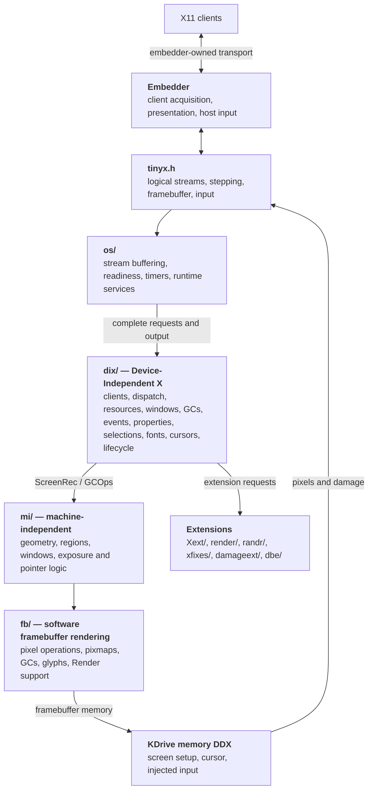
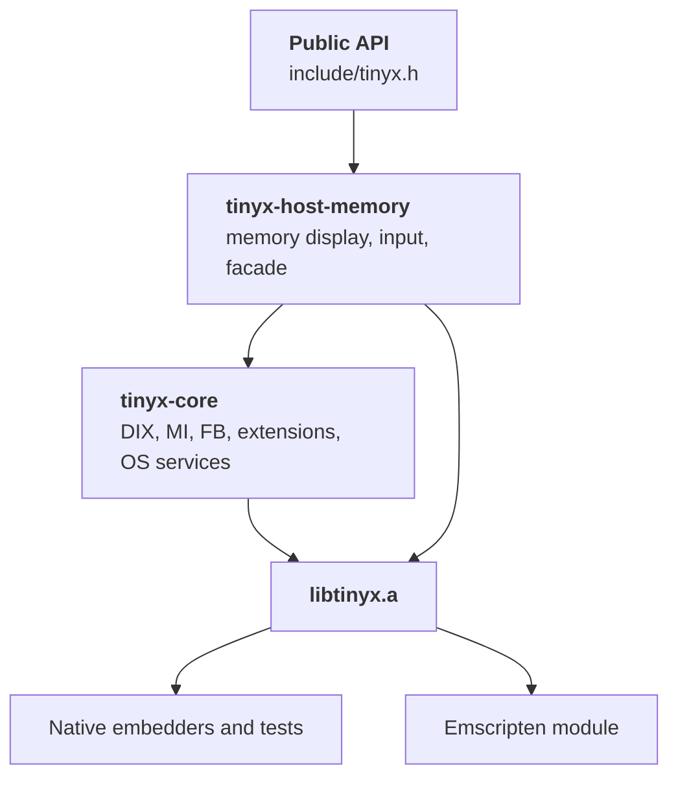
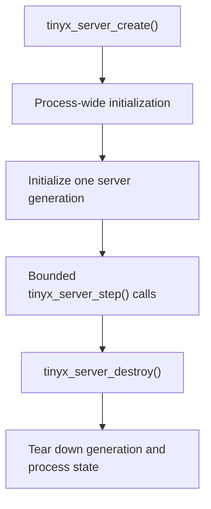
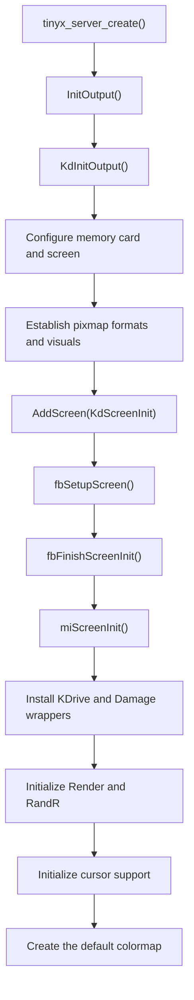
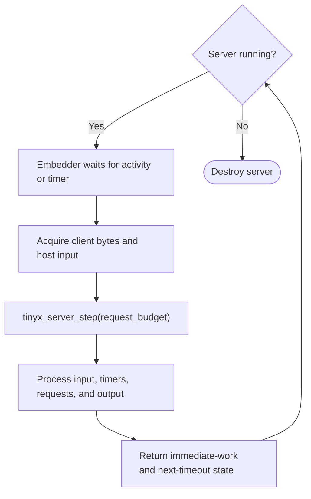
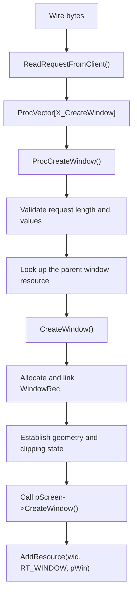
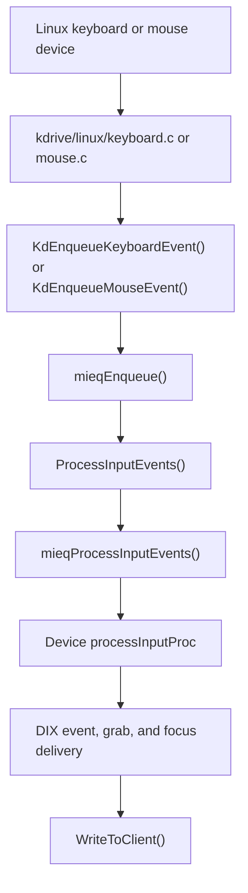
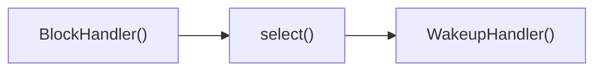

# A Guided Tour of the TinyX Architecture

TinyX is not a small X implementation written from scratch. It is an
embeddable configuration of the traditional X server architecture, using
KDrive with a memory display backend. Consequently, the source uses
terminology and layering inherited from the XFree86/Xorg server. Historical
Linux framebuffer and VESA sources remain in the tree but are not built.

This document describes the architecture that exists today. It is intended as
a map for reading the code, not as a proposal for how the server should be
rewritten.

## 1. The server in one picture

At a high level, an X server accepts byte streams from clients, decodes X11
requests, mutates server-side objects, renders into screens, and sends replies
and events back to clients.



The internal boundaries are not perfectly clean, but the public embedding
boundary is explicit: TinyX owns X11 semantics and rendering; embedders own
client acquisition, event acquisition, and presentation.

## 2. Vocabulary: DIX, DDX, MI, and FB

These names appear frequently in filenames, comments, symbols, and headers.

### DIX: Device-Independent X

`dix/` implements the core semantics of an X server. It understands X11
clients and resources but delegates screen operations through function
pointers.

Important responsibilities include:

- decoding core protocol requests;
- maintaining clients and their state;
- managing XIDs and resources;
- maintaining the window tree;
- event selection, propagation, grabs, and focus;
- graphics contexts, pixmaps, colormaps, cursors, and fonts;
- extension registration;
- server startup, reset, and shutdown.

“Device-independent” does not mean “platform-independent library” in the
modern sense. DIX still calls externally supplied DDX hooks and depends on the
OS layer.

### DDX: Device-Dependent X

The DDX adapts the generic X server to a display and input environment. TinyX
uses KDrive with `kdrive/memory/` as its supported backend. It renders into
ordinary memory and accepts input through the embedding API. Historical fbdev
and VESA backends remain as unbuilt reference sources.

The DDX supplies global entry points expected by DIX, including `InitOutput`,
`InitInput`, `ddxProcessArgument`, and `ddxUseMsg`.

### MI: Machine Independent

`mi/` contains reusable implementations of screen and drawing algorithms:
regions, arcs, polygons, lines, window validation, exposure handling, pointer
tracking, software cursors, and the machine-independent input queue.

MI generally operates through `ScreenRec` and `GCPtr` callbacks rather than
knowing how pixels reach physical hardware.

### FB: Framebuffer

`fb/` is a software rasterization backend. It implements screen, pixmap,
window, GC, glyph, and Render operations against framebuffer memory.

This is distinct from `kdrive/fbdev/`:

- `fb/` draws pixels into memory;
- `kdrive/fbdev/` opens and maps a Linux framebuffer device and describes that
  memory to KDrive and FB.

That distinction is central to understanding why much of the rendering stack
is already independent of Linux framebuffer devices.

## 3. The source tree by responsibility

| Path | Responsibility |
|---|---|
| `dix/` | Core server state and X11 protocol semantics |
| `include/` | Internal server interfaces and object definitions |
| `os/` | Runtime services, client streams, buffering, timers, and legacy native code |
| `mi/` | Generic rendering, regions, windows, pointer, and event queue logic |
| `fb/` | Software framebuffer renderer |
| `kdrive/src/` | Shared compact DDX implementation |
| `kdrive/memory/` | Supported memory display and public API facade |
| `embedders/` | Runnable hosts that acquire clients/input and present pixels |
| `kdrive/linux/`, `fbdev/`, `vesa/` | Unbuilt historical native backends |
| `miext/damage/` | Internal drawable damage tracking |
| `miext/shadow/` | Shadow framebuffer and rotation support |
| `Xext/` | Traditional protocol extensions such as SHAPE and BIG-REQUESTS |
| `render/` | RENDER extension and software picture composition |
| `randr/` | RANDR extension |
| `xfixes/` | XFIXES extension |
| `damageext/` | DAMAGE protocol extension |
| `dbe/` | DOUBLE-BUFFER extension |

Most headers in `include/` expose shared internal structures. `tinyx.h` is the
installed public embedding API.

### Compile and link dependency graph

CMake compiles each `.c` file separately into two object targets:
`tinyx-core` contains DIX, MI, FB, extensions, Damage, shadow, and generic OS
code; `tinyx-host-memory` contains KDrive's shared machinery and the memory
host. Their objects are combined into the installed `libtinyx.a`.



Object targets avoid imposing artificial static-archive ordering on the
legacy callback graph. The source still uses callbacks, wrappers, required
global symbols, and shared globals in both directions: DIX calls through
`ScreenRec`, while FB, MI, KDrive, and extensions call services back in DIX.
The two CMake targets are therefore product/source boundaries, not a strict
semantic dependency DAG.

All manifests exclude native transports, authorization, Linux input, and
hardware display backends; Emscripten additionally excludes shared memory.
Generated target-specific configuration headers make those choices explicit.
For a source-level
dependency graph and analysis of the host seams, see
[Finding the Embedding Boundaries](embedding-boundaries.md).

## 4. The central object model

The server is built around a small number of large C structures connected by
pointers and function tables.

### `ScreenInfo` and `ScreenRec`

The global `screenInfo` in `dix/globals.c` describes the server's image formats
and installed screens:

```c
typedef struct _ScreenInfo {
    int imageByteOrder;
    int bitmapScanlineUnit;
    int bitmapScanlinePad;
    int bitmapBitOrder;
    int numPixmapFormats;
    PixmapFormatRec formats[MAXFORMATS];
    int numScreens;
    ScreenPtr screens[MAXSCREENS];
} ScreenInfo;
```

Each `ScreenRec` contains screen properties and a large virtual function table.
Among other things, it provides callbacks for:

- window creation, mapping, painting, validation, and exposure;
- pixmap creation and destruction;
- image and span access;
- GC creation;
- cursor operations;
- fonts and colormaps;
- block and wakeup handling;
- screen resource creation and shutdown.

`ScreenRec` is one of the main architectural seams. DIX calls its operations;
MI, FB, KDrive, and extensions install or wrap those operations.

### Drawables, windows, and pixmaps

A drawable is anything that can be a rendering source or destination. Windows
and pixmaps begin with a `DrawableRec`, allowing code to accept a
`DrawablePtr` and inspect its type, depth, dimensions, ID, and screen.

A `WindowRec` additionally stores:

- parent, child, and sibling links;
- geometry and origin;
- clipping and border regions;
- background and border state;
- mapping and visibility state;
- selected event masks;
- optional properties, cursor, colormap, grabs, and shape regions.

The root window for each screen is stored in the global `WindowTable[]`.
Windows form a tree beneath it.

A pixmap is an off-screen drawable. FB also uses a pixmap to represent the
screen's backing memory, allowing many window and pixmap operations to share
the same rasterization code.

### Graphics contexts

A graphics context (`GC`) holds drawing state: foreground and background
pixels, raster operation, plane mask, line and fill styles, font, tile,
stipple, clipping, and related values.

A GC contains two tables:

- `GCFuncs` manages GC state and clipping;
- `GCOps` performs drawing operations such as `FillSpans`, `PutImage`,
  `CopyArea`, lines, polygons, rectangles, arcs, text, and glyph blits.

DIX validates protocol arguments and manages GC lifetime. The screen's
`CreateGC` callback supplies the implementation, normally FB in this tree.

### Clients

`ClientRec`, defined in `include/dixstruct.h`, represents one X11 client. It
contains:

- a numeric client index and XID prefix;
- the current request buffer and request length;
- byte-order state;
- sequence and error state;
- a pointer to OS/transport-private state;
- resource and save-set state;
- the active request dispatch vector;
- cached drawable and GC lookups;
- extension-private storage.

`clients[]` is a global array. Index zero is the special `serverClient`, used
for resources created by the server itself. Real clients begin at index one.

### Resources and XIDs

Most client-visible objects are resources identified by 32-bit XIDs. The
resource manager in `dix/resource.c` maps IDs to typed pointers and tracks
ownership by client.

Core resource types include windows, pixmaps, GCs, fonts, cursors, colormaps,
and passive grabs. Extensions can register additional resource types with
`CreateNewResourceType()` and provide a destructor.

This arrangement is what allows a request to contain only an integer ID while
DIX recovers a typed server object and enforces ownership and access rules. It
also allows all of a client's resources to be destroyed when that client
exits.

### Private storage

Many structures have a `DevUnion *devPrivates` array. Components allocate a
private index during initialization and use that slot to attach their own data
to screens, clients, windows, GCs, pixmaps, devices, colormaps, and extensions.

This is an old C equivalent of extensible object fields. It avoids putting
every extension's state directly into every core structure, but it also means
that initialization order and generation resets matter.

## 5. Startup and server generations

The public entry point is `tinyx_server_create()` in `kdrive/memory/api.c`.
It enters the extracted lifecycle operations in `dix/lifecycle.c`:



The internal X server still has generation machinery, but the public singleton
facade exposes one generation and no reset operation.

### Process-wide setup

During creation, `TinyXServerInitialize()` establishes connection limits and
process-global server state. Command-line parsing, authority files, listeners,
and process-owned signals are not part of the embedding product.

### Generation initialization

For each generation, `TinyXServerInitializeGeneration()` performs roughly this
sequence:

1. Reset screen-saver and DPMS state.
2. Initialize block/wakeup handlers.
3. Call `OsInit()`.
4. Initialize descriptor-free connection bookkeeping.
5. Create and initialize `serverClient`.
6. Initialize the server client's resource table.
7. Initialize atoms, events, glyph caches, callbacks, and private indices.
8. Call the DDX's `InitOutput()` to install screens.
9. Initialize protocol extensions.
10. Create per-screen scratch pixmaps, scratch GCs, stipples, and root windows.
11. Call the DDX's `InitInput()` and start input devices.
12. Initialize fonts, the default font, and root cursor.
13. Finish and map each root window.
14. Construct the X11 connection setup block advertised to new clients.
15. Start dispatch state and return control to the embedder.

The ordering is significant. For example, output must exist before root
windows, input registration refers to the first screen, and the connection
setup block needs fully initialized formats, visuals, roots, and keycodes.

### Generation teardown

During destruction, the lifecycle code:

- restores the screen saver if necessary;
- closes extensions;
- frees all resources;
- closes input devices;
- closes and frees screens in reverse order;
- closes events and fonts;
- cleans up OS state;
- shuts down the singleton facade.

Fatal lifecycle operations run inside the protected host boundary so an
embedder receives an error instead of losing control of its process.

## 6. How output is initialized

`kdrive/memory/meminit.c` supplies the DDX entry points and delegates to
`KdInitOutput()`. The path is:



### `KdCardFuncs`

A display backend describes itself with `KdCardFuncs`. Its callbacks cover:

- card and screen discovery;
- mode and framebuffer setup;
- screen initialization;
- resource creation;
- enable, disable, preserve, restore, and DPMS;
- cursor and acceleration support;
- palette access;
- screen and card teardown.

The memory backend registers its `KdCardFuncs` from `InitCard()`.

### What the memory backend contributes

`kdrive/memory/memory.c` validates or allocates linear framebuffer storage,
materializes configured depths and visuals, initializes Damage tracking, and
supports atomic framebuffer replacement during resize. It performs no device
mapping, modesetting, or presentation. Generic KDrive and FB code perform the
drawing.

### What FB and MI install

`fbSetupScreen()` fills much of `ScreenRec` with FB implementations, including
image access, pixmaps, windows, GCs, fonts, and colormaps.

`fbFinishScreenInit()` creates visuals and depths and calls `miScreenInit()`,
which installs generic window-tree and exposure machinery. KDrive then wraps
selected operations such as `CloseScreen`, `CreateScreenResources`, window
creation, colormaps, cursor handling, and block/wakeup callbacks.

The result is a layered function table rather than a single backend owning all
screen behavior.

## 7. The main dispatch loop

The dispatcher in `dix/dispatch.c` is the center of normal server execution.
Its lifecycle is split into `DispatchStart()`, `DispatchStep()`, and
`DispatchFinish()`. Embedders call `tinyx_server_step()`, which polls once,
processes no more than the supplied request budget, and returns without
waiting.

Conceptually an embedder drives this loop:



Internal scheduling retains client priorities and fairness while enforcing the
embedder's request budget.

### Polling

`PollForSomething()` in `os/WaitFor.c` processes deferred work, complete
buffered requests, timers, block/wakeup handlers, and pending output without
waiting. `TimerNextDelay()` reports the next deadline to the embedder.
Descriptor-free readiness is merged with DIX client priorities and dispatch
scheduling before the bounded request loop runs.

### Reading a request

`ReadRequestFromClient()` in `os/io.c` owns per-connection input buffering. It:

1. preserves partial input between calls;
2. reads enough bytes for an `xReq` header;
3. determines the full request length;
4. handles BIG-REQUESTS headers;
5. reads until one complete request is available;
6. places a contiguous request at `client->requestBuffer`;
7. records whether another complete request is already buffered.

The protocol layer receives complete requests rather than arbitrary chunks of
the transport stream.

### Dispatch vectors

For a running client, the request's first byte is the major opcode:

```c
result = (*client->requestVector[MAJOROP])(client);
```

The core `ProcVector[256]` in `dix/tables.c` maps core opcodes to handlers such
as `ProcCreateWindow`, `ProcGetProperty`, `ProcCreateGC`, and
`ProcPolyFillRectangle`.

A byte-swapped client uses `SwappedProcVector`. New clients initially use
`InitialVector`, which handles connection setup before switching the client to
the normal vector.

Handlers conventionally return `Success` or an X11 error code. Dispatch turns
errors into protocol error packets with `SendErrorToClient()`.

### Writing replies and events

Protocol code calls `WriteToClient()` in `os/io.c`. It adds required padding,
buffers output, and eventually calls `FlushClient()`. `FlushClient()` writes
through the `TinyXTransportOps` byte-stream interface and retains unwritten
bytes when the adapter reports backpressure. The memory adapter becomes
writable when its embedder drains queued output.

Replies, errors, and events all ultimately use this path. Transport operations
report progress, would-block, orderly close, and failure explicitly, so framing
and buffering do not inspect descriptors or `errno`.

## 8. Connection establishment

Supported products acquire clients through their embedder. The embedder opens
a descriptor-free logical client and moves bytes through the public API; TinyX
never listens or accepts connections itself.

`OsCommRec` is the transport-facing portion of a client. It contains input and
output buffers, byte-stream operations and adapter-private data, and readiness
and backpressure state. The pointer is stored in `ClientRec.osPrivate`.
`TinyXMemoryClientOpen()` creates this logical connection and calls
`NextAvailableClient()`, preserving the artificial initial request and normal
DIX handshake.

### The artificial initial request

`NextAvailableClient()` creates a `ClientRec`, gives it a resource table, and
inserts a small artificial request before the actual connection bytes. This
lets connection establishment run through the ordinary request machinery.

The initial dispatch sequence is:

1. `ProcInitialConnection()` reads the client's byte order and expands the
   request length to include authorization data.
2. `ProcEstablishConnection()` validates protocol versions and authorization.
3. `SendConnSetup()` sends the setup prefix and screen information.
4. The client switches from `InitialVector` to `ProcVector` or
   `SwappedProcVector` and enters `ClientStateRunning`.

### The setup block

`CreateConnectionBlock()` in `dix/main.c` serializes the mostly shared portion
of the connection setup response:

- server release and vendor;
- image and bitmap byte order;
- pixmap formats;
- root screens;
- depths and visuals;
- input keycode range.

Per-client resource ID fields and current root event masks are filled in when
the block is sent.

## 9. Following a core protocol request

A useful way to understand DIX is to follow `CreateWindow`:



The exact division is representative:

- `Proc*` functions deal with wire-level requests and X errors;
- DIX object functions implement protocol semantics;
- the resource manager maps XIDs to object pointers;
- `ScreenRec` callbacks delegate screen-specific work;
- MI and FB normally provide those callbacks.

A drawing request follows the same pattern but ends at a GC operation. For
example, a rectangle request looks up the drawable and GC, validates the GC,
and eventually calls the active `pGC->ops->PolyRectangle` or
`PolyFillRect`. In this configuration, that operation is generally supplied
by FB, sometimes with MI used for geometry or fallback behavior.

## 10. Windows, clipping, and rendering

X rendering is not simply “draw into a buffer at these coordinates.” DIX and
MI maintain the window tree and compute which portions of each window are
visible.

Important regions in `WindowRec` include:

- `winSize`: the window's interior geometry;
- `borderSize`: the geometry including its border;
- `clipList`: visible output region after clipping by ancestors and children;
- `borderClip`: visible border and areas not clipped by children.

Mapping, unmapping, moving, resizing, stacking, and shaping windows cause MI
validation code to recompute regions. Exposure processing determines which
clients must repaint newly visible areas.

GC validation combines drawing state with the destination drawable and its
current clipping. The selected `GCOps` then rasterize only the permitted
regions.

FB performs raster operations directly on pixmap or framebuffer memory. It
contains optimized implementations for different depths, stipples, tiles,
copy operations, glyphs, and compositing. MI handles operations that are more
naturally expressed as generic geometry or spans.

## 11. Input flow

Input travels in the opposite direction from rendering: host events are
translated into X events, queued, and then dispatched through DIX.

For the native KDrive build:



### Input device initialization

The final DDX's `InitInput()` calls:

```c
KdInitInput(&LinuxMouseFuncs, &LinuxKeyboardFuncs);
```

`KdInitInput()`:

- selects the mouse and keyboard backend functions;
- loads the keymap and modifier map;
- creates core pointer and keyboard devices;
- registers them with DIX and MI;
- initializes the MI event queue with `mieqInit()`.

### The MI event queue

`mi/mieq.c` contains a fixed-size queue of `xEvent` records. Producers call
`mieqEnqueue()`. The queue's head and tail are registered with
`SetInputCheck()`, allowing Dispatch to notice pending input without a system
call.

`ProcessInputEvents()` in KDrive drains the MI queue, updates the pointer, and
handles VT-switch and lock state. `mieqProcessInputEvents()` invokes the
appropriate device's `processInputProc`, after which DIX handles focus,
grabs, event selection, propagation, and delivery.

## 12. Extensions

Extensions add requests, events, errors, resources, and often wrappers around
screen operations.

`mi/miinitext.c` contains TinyX's extension initialization list. During
startup, `InitExtensions()` calls enabled initializers for SHAPE, MIT-SHM,
XTEST, BIG-REQUESTS, SYNC, RENDER, RANDR, XFIXES, DAMAGE, and configured
optional extensions.

An extension calls `AddExtension()` in `dix/extension.c`, supplying:

- its name;
- numbers of events and errors;
- normal and byte-swapped request dispatch functions;
- shutdown and minor-opcode functions.

`AddExtension()` assigns a major opcode beginning at 128 and installs the
handlers into `ProcVector` and `SwappedProcVector`.

Many extensions are implemented by wrapping existing callbacks. A typical
pattern is:

1. save a screen or GC callback in extension-private storage;
2. replace it with an extension wrapper;
3. perform extension bookkeeping before or after the saved callback;
4. call through to the next layer.

This makes callback ordering important. The explicit initialization order in
`InitExtensions()` sometimes documents such requirements; for example,
XFixes is initialized before Render for cursor wrapping.

`miext/damage/` is the internal mechanism for noticing drawable changes,
whereas `damageext/` exposes that facility through the DAMAGE wire protocol.
Similarly, `render/` contains both extension dispatch and substantial
software rendering support.

## 13. KDrive's internal architecture

KDrive is the compact DDX framework shared by both final servers.

### Cards and screens

A `KdCardInfo` represents a display device and points to a `KdCardFuncs`
table. A card owns a list of `KdScreenInfo` records.

`KdScreenInfo` stores desired and discovered screen state, including:

- dimensions, refresh rate, and physical size;
- rotation and subpixel order;
- the selected card and driver-private data;
- framebuffer address, depth, bits per pixel, pixel stride, byte stride, and
  color masks;
- cursor, shadow, and acceleration choices.

`KdPrivScreenRec` is attached to the corresponding `ScreenRec` and joins the
KDrive description to the DIX screen object.

### Host OS operations

`KdOsFuncs` abstracts a small portion of host behavior:

```c
typedef struct _KdOsFuncs {
    int  (*Init)(void);
    void (*Enable)(void);
    Bool (*SpecialKey)(KeySym);
    void (*Disable)(void);
    void (*Fini)(void);
    void (*pollEvents)(void);
} KdOsFuncs;
```

`kdrive/linux/linux.c` implements this interface for Linux virtual terminals,
APM, and console ownership. It installs the table through the global
`OsVendorInit()` hook called by `OsInit()`.

This interface does not cover network clients, the dispatcher, filesystem
access, or the core runtime services. Those remain in the broader OS layer.

### Core host runtime services

`TinyXHostOps` is a separate singleton interface for facilities needed by the
host-independent core: a monotonic millisecond clock, diagnostic logging, and
a host wakeup notification. Native execution is the default and retains the
system monotonic clock, stderr output, and existing process behavior. A custom
in-process host can supply callbacks before initializing the server.

All scheduling timestamps obtained through `GetTimeInMillis()` are delegated
to this clock. Changing the earliest timer deadline, feeding or closing a memory client, or
relieving its output backpressure requests a host wakeup. The wakeup is only
a notification: the host remains responsible for deciding when to call the
nonblocking server step.

Fatal errors use an explicit poisoned-server policy. Custom hosts invoke core
operations through `TinyXHostRunProtected()`. `FatalError()` logs and records
the diagnostic, poisons the singleton, and unwinds to that boundary rather
than returning through an invalid core stack or terminating the host process.
The poisoned singleton cannot process further operations. Native calls retain
the traditional DDX cleanup and process termination behavior.

### Memory display and presentation

`kdrive/memory/` supplies a KDrive card whose framebuffer is ordinary linear
memory rather than mapped display hardware. A host may provide the storage or
let the backend allocate it for the active generation. The initial format is
depth-24 TrueColor in 32 native-endian bits per pixel, with red, green, and
blue masks `0x00ff0000`, `0x0000ff00`, and `0x000000ff`. FB and MI render into
this buffer through the same `ScreenRec` operations used by native backends.

The provisional `tinyx-display.h` interface exposes dimensions, stride, masks,
and the pixel pointer without exposing `KdScreenInfo`. A Damage object attached
to the screen pixmap accumulates changed regions. The host drains those regions
at a step boundary; when caller storage is too small, they collapse to one
bounding rectangle. The memory backend can atomically replace the dimensions,
stride, and allocated or borrowed storage of its single screen. It updates the
screen pixmap and root clipping, fully damages the replacement, and uses RandR
to notify X11 clients. At generation creation it can also install an ordered,
host-supplied list of FB-supported pixmap depths and exact X11 visuals while
keeping the presented root at depth 24 in 32 bpp. Alternate-depth resources do
not imply overlay composition into that root framebuffer. No core code performs
window-system presentation or pixel upload. The native fbdev and VESA backends
remain separate and unchanged.

### Host input injection

The provisional `tinyx-input.h` interface injects absolute root coordinates,
relative pointer deltas, button transitions, and X keycode transitions into the
KDrive devices without opening input descriptors. KDrive maintains device
state and passes injected events through MI's event queue and ordinary DIX
delivery, preserving focus, grabs, propagation, pointer acceleration, button
mapping, and middle-button emulation. Enqueuing input requests a cooperative
host wakeup.

The memory keyboard supplies the conventional US Xorg keymap (evdev keycode
plus 8) for X keycodes 8 through 247. Translation from DOM codes, SDL scan
codes, evdev codes, or symbols is a host responsibility. Repeat timing is also
host-owned: repeated press input is
filtered through the active X keyboard repeat controls. The memory pointer has
five X buttons. Optional callbacks expose X bell and LED changes to the host;
the core does not choose an audio or physical LED implementation. Historical
Linux acquisition code uses the same lower-level KDrive enqueue functions but
is not part of a supported product.

### Public embedding facade

`include/tinyx.h` is the versioned host-facing API over these internal seams.
It contains only opaque server and client handles, fixed-width values, buffer
descriptions, status values, and callbacks; no DIX, KDrive, Xtrans, or native
OS structures cross the boundary. API v1 permits one server lifetime and one
generation per process or WASM module and is non-thread-safe and
non-reentrant.

`kdrive/memory/api.c` configures the host runtime, memory display, memory input
devices, embedded fonts, and descriptor-free clients, then enters lifecycle
and dispatch operations through the protected fatal-error boundary. Public
client stream names use the client's perspective: `tinyx_client_send()` moves
bytes to the server and may accept a bounded prefix, while
`tinyx_client_receive()` drains server output. Both queues are finite.

The framebuffer is exposed as read-only host data in native-endian depth-24,
32-bpp words. The creation-time screen descriptor may provide ordered pixmap
depths and exact visuals while retaining that fixed root presentation format.
The memory DDX materializes them as real `DepthRec` and `VisualRec` objects, so
clients can create alternate-depth colormaps, windows, pixmaps, and GCs. The
configuration is copied at creation and remains immutable; indexed overlay or
plane-group composition into the root framebuffer is not implied.

Mutable dimensions, physical dimensions, stride, and storage occupy a separate
framebuffer descriptor used at creation and resize. Resize invalidates the
previous framebuffer view and borrowed-storage lease and produces RandR
notifications. Physical millimeter dimensions let X11 and Xft clients derive
the intended DPI; zero dimensions retain the historical 75-DPI default at
creation and preserve DPI across resize. Damage consumption, pointer and key
injection, scheduling results, and callback lifetime are all represented
without server internals.
`embedders/headless/main.c` demonstrates startup and shutdown using only the
public header, and `api-test.c` drives an X11 setup handshake through the
facade. Every runnable product supplies its own entry point; the library has
none and creates no listeners.

`embedders/kitty/` is a complete native Rust embedder over this facade. It
adapts a nonblocking Unix-domain socket to descriptor-free TinyX clients, consumes
Damage before encoding the read-only framebuffer as PNG, and presents it with
the Kitty graphics protocol. Before starting concurrent terminal input, it
uses Kitty's terminal query protocol to obtain the active window's logical DPI
and converts that to X11 physical dimensions; an explicit override and a
75-DPI fallback cover unavailable queries. Terminal resize events resize the X
screen to the new available pixel area while preserving that DPI. Terminal
mouse events become absolute pointer motion and button injection. Enhanced
keyboard events use explicit Xorg-compatible
keycodes; modifier flags are converted into ordered synthetic key transitions
when the terminal does not report physical modifier keys separately. Completed
stock-st and stock-dwm validation covers this host, Xft/Render, selections,
core window-manager behavior, input, and resizing, as recorded in
[Running st and dwm on TinyX](dwm-integration-plan.md).

### CMake build products

The root `CMakeLists.txt` assembles explicit source manifests into
`tinyx-core` and `tinyx-host-memory` object targets, then combines them into
the installed `libtinyx.a`. Object targets avoid imposing artificial archive
link-order boundaries on the legacy callback graph. The headless and Kitty
embedders and API tests link the same static product.

Every target uses the descriptor-free admission policy in
`os/embedded-security.c`; `TINYX_MEMORY_ONLY` removes descriptor listeners and
the Xtrans adapter while retaining generic client bookkeeping and protocol
buffering. The supported manifests exclude Xtrans, XDMCP, native access and
authorization, Linux device acquisition, fbdev, and VESA. Native builds retain
MIT-SHM and XF86BIGFONT as protocol capabilities; Emscripten excludes them. Bounded
cooperative steps supply scheduling on both platforms. `tinyx-wasm.js` and
`tinyx-wasm.wasm` expose the public v1 functions through the explicit list in
`cmake/wasm-exports.json`.

CMake generates target-specific DIX and KDrive configuration headers without
consuming host-generated configuration or native `pkg-config` link results.
KDrive translation units include `kdrive-config.h`, which in turn includes
`dix-config.h`; this is required on 64-bit hosts so every subsystem uses the
server's 32-bit `XID` and `KeySym` definitions. Keyboard mappings are converted
explicitly between internal `KeySym` values and 32-bit wire values. The
external xorgproto dependency is headers-only. CMake is the sole supported
build; native hardware sources remain only as unbuilt historical reference.

### Shadow framebuffers

`miext/shadow/` supports rendering into shadow memory and copying transformed
or rotated regions to the physical framebuffer. KDrive uses it when the
hardware layout or selected rotation makes direct rendering inappropriate.

## 14. Timers, work queues, and block/wakeup handlers

Not all work originates from a ready client.

### Timers

`os/WaitFor.c` maintains an ordered list of `OsTimerRec` values. Timers provide
a callback, expiration time, and closure. `WaitForSomething()` incorporates
the next expiration into its `select()` timeout and runs expired callbacks.

### Work queue

Components can defer work with `QueueWorkProc()`. The dispatch wait path runs
`ProcessWorkQueue()` before blocking. Listener acceptance is one user of this
mechanism.

### Block and wakeup handlers

Screens and other components can register work immediately before and after
the server blocks. `WaitForSomething()` calls:



KDrive installs `KdBlockHandler` and `KdWakeupHandler` on each screen so input
and display backends can participate in the event loop.

These mechanisms are generic in purpose but currently coordinated around a
blocking Unix `select()` loop.

## 15. Fonts

Fonts cross several layers:

- DIX implements font protocol requests, font-path elements, aliases, and
  server-side resource lifetime;
- a font-path-element (FPE) backend supplies font acquisition, metrics, and
  glyph bitmaps;
- screen callbacks realize and unrealize fonts;
- GC text operations eventually invoke glyph rendering in FB or MI.

The supported CMake products register the host-independent `built-ins` FPE in
`dix/embedded-font.c` and link neither libXfont nor libfontenc. Its internal
catalog serves checked-in, development-time-generated 6x13 and cursor data.
The 6x13 font includes its complete 4,121-glyph BMP repertoire and both
ISO10646-1 and historical ISO8859-1 names. An acquire/release lease separates catalog
ownership from conversion into an
ordinary `FontRec`, so a later embedding provider can reuse the materializer
without exposing DIX structures. Phase 7 intentionally exposes only the
built-in catalog.

Generated rows have a canonical representation. Opening a font converts them
to DIX's requested bit order, byte order, scan unit, and glyph padding. The
result then follows the same QueryFont, text rendering, glyph-cursor, screen
realization, resource, and reset paths as a libXfont font. Unsupported names
and paths produce normal X11 errors.

Startup requires both a default text font and a cursor font. The root cursor
is constructed from the latter. The embedded backend supplies both without a
filesystem, confirming that fonts are part of core startup rather than merely
an optional protocol feature. The proposed
[host-provided font design](font-provider-design.md) extends this catalog with
a frozen host-source manifest and lazy, synchronous BDF/PCF payload acquisition
while keeping file I/O and decompression outside protocol dispatch and the
core.

## 16. Global state and the singleton model

The server is designed as a single process-wide instance. Representative
globals include:

- `screenInfo`;
- `clients[]` and `serverClient`;
- `WindowTable[]`;
- `serverGeneration`;
- atoms, resource tables, extension tables, input devices, timers, and work
  queues;
- KDrive card, screen, and input state.

Function tables provide modularity within that singleton, but there is no
server context object containing all state. This is typical of the X server
code from which TinyX descends.

The generation mechanism permits reset and reinitialization of much global
state, but it is not the same as supporting multiple simultaneous server
instances.

## 17. Existing architectural seams

The code uses several different styles of interface:

### Required global symbols

DIX expects the linked DDX to define functions such as:

- `InitOutput()`;
- `InitInput()`;
- `ddxProcessArgument()`;
- `ddxUseMsg()`;
- `ddxGiveUp()`;
- `AbortDDX()`.

The linker selects an implementation based on which frontend is used.

### Callback tables

Examples include:

- `ScreenRec`;
- `GCFuncs` and `GCOps`;
- `KdCardFuncs`;
- `KdOsFuncs`;
- `KdMouseFuncs` and `KdKeyboardFuncs`.

These are explicit runtime interfaces.

### Registered extension points

Examples include:

- resource types and destructors;
- private indices;
- callbacks;
- block/wakeup handlers;
- timers and work procedures;
- protocol extensions.

### Direct concrete dependencies

The supported library still inherits process-oriented implementation details
such as global `fd_set` bookkeeping and required DDX symbols, but its CMake
configuration excludes Xtrans, native authorization, device acquisition, and
hardware presentation. The public lifecycle and dispatch code do not own an
entry point, blocking wait, client acquisition, presentation, monotonic clock,
logging, or fatal process policy.

Historical native adapters remain in the source tree as unbuilt reference
code. The supported architecture is modular at the public embedding boundary,
while internals retain the traditional X server singleton and callback graph.

## 18. Suggested reading paths

The tree is easier to understand by following one path at a time rather than
reading directories in order.

### Server lifecycle

1. `include/tinyx.h`
2. `kdrive/memory/api.c`
3. `dix/lifecycle.c`
4. `kdrive/memory/meminit.c`
5. `kdrive/src/kdrive.c` (`KdInitOutput`, `KdScreenInit`)

### Client and request dispatch

1. `os/memory.c` (`TinyXMemoryClientOpen`)
2. `dix/dispatch.c` (`NextAvailableClient`, connection setup)
3. `os/WaitFor.c`
4. `os/io.c` (`ReadRequestFromClient`)
5. `dix/dispatch.c` (`Dispatch`)
6. `dix/tables.c`

### Windows and rendering

1. `include/scrnintstr.h`
2. `include/windowstr.h`
3. `include/gcstruct.h`
4. `dix/window.c`
5. `dix/gc.c`
6. `mi/miscrinit.c` and `mi/miwindow.c`
7. `fb/fbscreen.c`, `fb/fbgc.c`, and `fb/fbwindow.c`

### Input

1. `include/tinyx.h` (injection API)
2. `kdrive/memory/api.c`
3. `kdrive/src/kinput.c` (`KdInitInput`, enqueue functions)
4. `mi/mieq.c`
5. `dix/events.c`

### Extensions

1. `mi/miinitext.c`
2. `dix/extension.c`
3. one small extension such as `Xext/bigreq.c`
4. a wrapping extension such as `miext/damage/damage.c`

## 19. Summary

TinyX has a layered architecture inherited from the traditional X server:

- **OS** turns transports and host events into ready clients and byte streams.
- **DIX** implements X11 state, objects, protocol semantics, and event delivery.
- **MI** supplies generic geometry, window, cursor, and input algorithms.
- **FB** rasterizes into framebuffer memory.
- **KDrive** assembles those pieces into a compact DDX.
- **the memory host** supplies framebuffer storage and injection endpoints.
- **embedders** acquire clients and input and present framebuffer damage.
- **extensions** add protocol and wrap core object operations.

The most important architectural idea is that rendering behavior is assembled
through object function tables, while client processing is assembled through
request vectors and the OS scheduler. The public embedding facade now composes
host-independent lifecycle, client-stream, display, input, font, and runtime
boundaries. The implementation remains a process-global singleton internally;
multiple instances and thread safety require a separate state-isolation
project.
