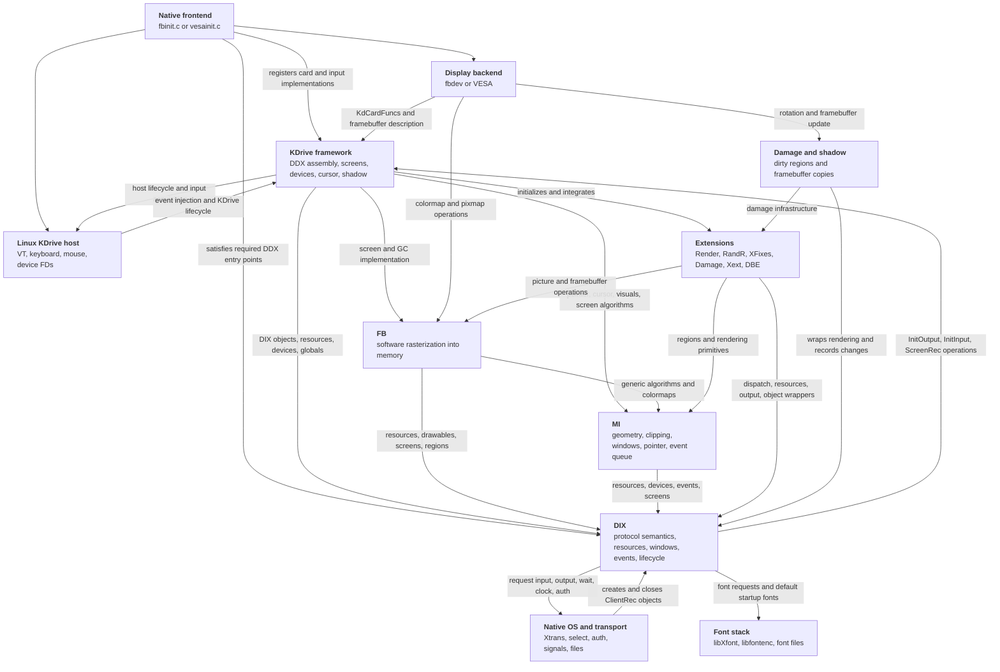
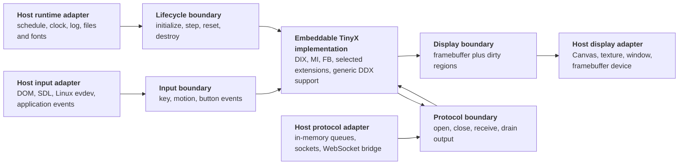
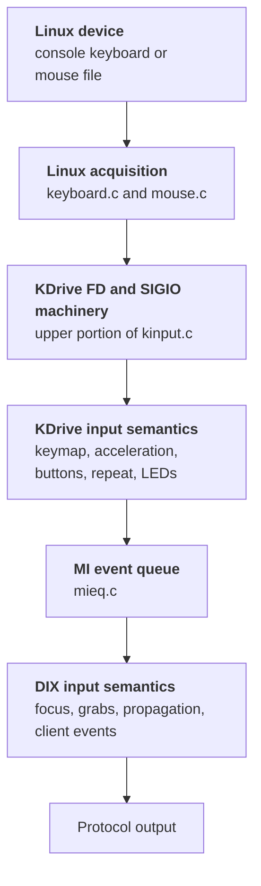
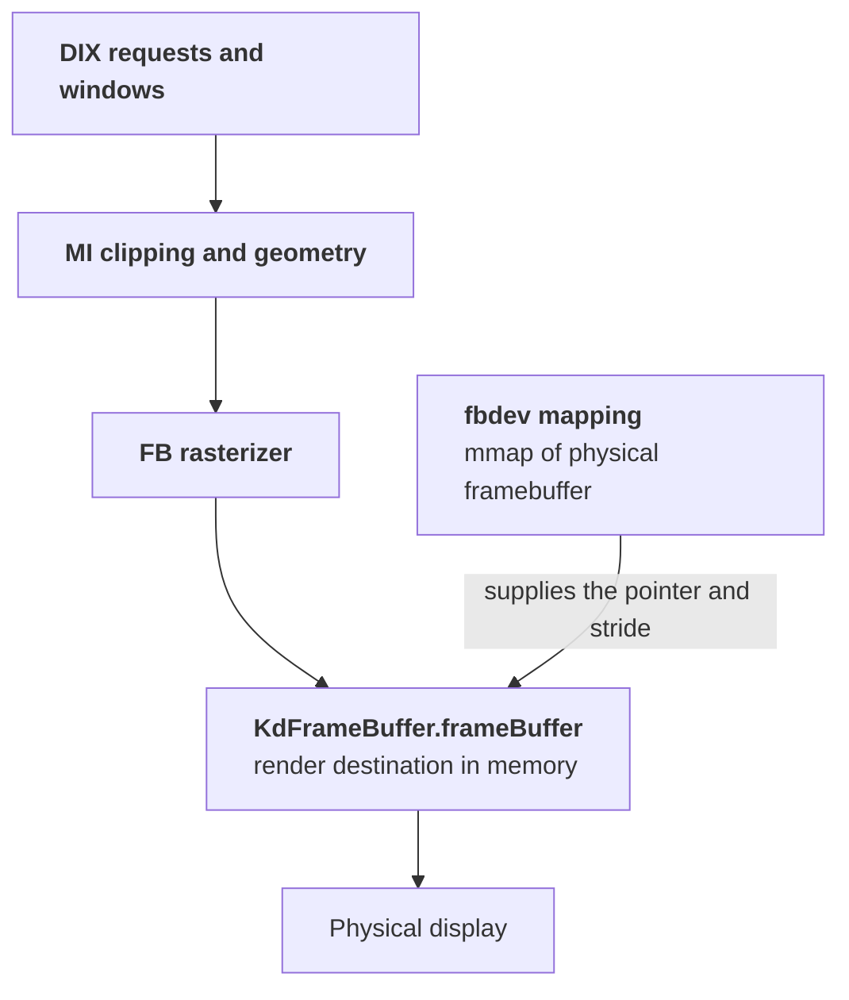
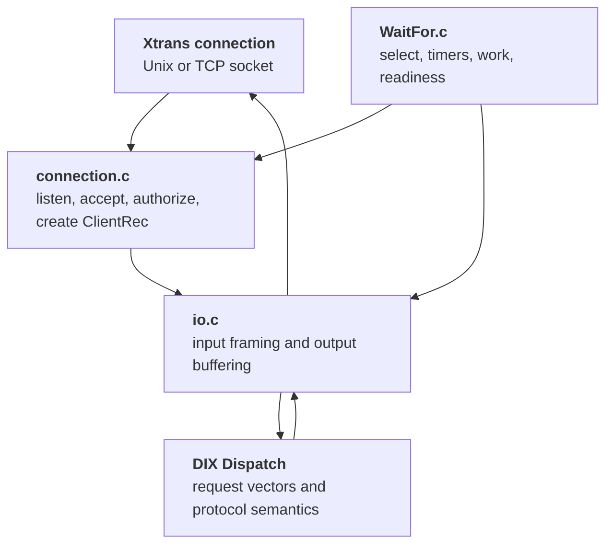
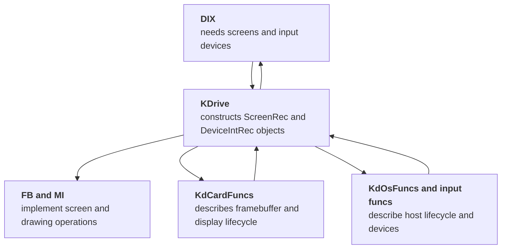

# Finding the Embedding Boundaries

> **Historical design record:** this document describes the pre-embedding
> architecture and the seams used during extraction. Supported products now
> use the public API and descriptor-free clients described in
> [the architecture tour](architecture.md).

This document maps TinyX's source dependencies onto the interfaces an
embeddable server needs. It complements the [architecture tour](architecture.md).

Build-target boundaries alone cannot identify these interfaces. TinyX has
calls, callbacks, and globals that cross them in both directions. The useful
question is instead:

> Which code implements X server semantics, and which code acquires or
> presents data on behalf of a particular host?

For an embedder, there are three principal I/O boundaries:

1. pointer and keyboard input into the server;
2. rendered screen contents out to the host;
3. bidirectional X11 protocol streams between clients and the server.

Lifecycle, time, logging, fonts, and scheduling form additional host boundaries
that become visible once the process-oriented `main()` is removed.

## 1. Source-level dependency graph

The following graph shows the important **symbol and callback dependencies** in
the current native server. An arrow means “calls, references, or requires an
interface supplied by.” This is deliberately different from the link-order
graph.



This graph explains why the existing archives do not define an abstraction
boundary by themselves. For example, KDrive calls DIX services while DIX calls
KDrive-supplied DDX entry points; the native transport creates DIX clients while
DIX calls transport I/O; FB calls DIX and MI while DIX reaches FB through
function tables.

These cycles are normal inside the current executable. The library refactor
does not need to eliminate every cycle. It needs to surround the complete
server implementation with explicit host-facing interfaces.

## 2. A more useful ownership split

A practical split is:



The API boundaries should be defined in terms of data the host actually has,
not Unix file descriptors, Linux scan devices, VTs, or physical video cards.
A native embedder can implement the same interfaces using whatever window,
terminal, socket, or event facilities it chooses.

## 3. User input boundary

### 3.1 Where input lives today

Current native input follows this path:



The relevant existing entry points are:

```c
void KdEnqueueKeyboardEvent(unsigned char scan_code, unsigned char is_up);
void KdEnqueueMouseEvent(KdMouseInfo *mi,
                         unsigned long flags,
                         int x,
                         int y);
void KdEnqueueMotionEvent(KdMouseInfo *mi, int x, int y);
```

These functions are already close to an injection boundary. They convert
KDrive's input representation into X events and enqueue those events through
MI. DIX then owns focus, grabs, event selection, and delivery.

### 3.2 What belongs on the host side

- reading native devices or receiving browser/application events;
- mapping host key identifiers into the chosen TinyX key representation;
- converting host pointer buttons and coordinates;
- scheduling delivery onto the server's thread;
- host-specific LED and bell effects, if supported.

In the inherited native server this was principally
`kdrive/linux/keyboard.c`, `kdrive/linux/mouse.c`, and the
file-descriptor/SIGIO portion of `kdrive/src/kinput.c`.

### 3.3 What belongs on the server side

- X keyboard and pointer devices;
- key-down state, modifiers, repeat policy, and button mapping;
- pointer acceleration if the API accepts raw relative motion;
- middle-button emulation;
- MI event queueing;
- DIX focus, grabs, propagation, and client event generation.

This is mostly the portable portion of `kdrive/src/kinput.c`, `mi/mieq.c`, and
DIX device and event code.

### 3.4 The existing interface is incomplete

`KdMouseFuncs` and `KdKeyboardFuncs` are lifecycle interfaces for device
drivers, but they still assume KDrive's native acquisition model.
`KdKeyboardFuncs.Load`, for example, lets Linux read the console keymap, and
KDrive's FD registration directly uses `fcntl()`, `SIGIO`, `fd_set`, and the OS
wait loop.

A clean embedder interface should bypass acquisition and inject normalized
events. KDrive's enqueue functions are a good implementation seam, but the
portable translation logic should be separated from the Unix FD and signal
logic.

One design decision remains: whether the public API accepts X keycodes, KDrive
scan codes, USB-style key positions, or symbolic host keys. Accepting X
keycodes makes the core boundary smallest; accepting portable physical-key
identifiers makes the embedding API friendlier but requires a keymap component
inside the library.

## 4. Display output boundary

### 4.1 Where display output lives today

The current fbdev path is:



There is normally no explicit “present” call. FB writes directly into the
memory mapped by the display backend, and the hardware scans that memory out.
This is why the current `KdCardFuncs` interface describes allocation, mapping,
formats, modes, palette, enablement, and lifecycle rather than exposing a
simple blit callback.

### 4.2 The existing backend seam

A KDrive display backend supplies `KdCardFuncs` and fills `KdScreenInfo`, in
particular:

```c
typedef struct _KdFrameBuffer {
    CARD8 *frameBuffer;
    int depth;
    int bitsPerPixel;
    int pixelStride;
    int byteStride;
    Bool shadow;
    unsigned long visuals;
    Pixel redMask, greenMask, blueMask;
    void *closure;
} KdFrameBuffer;
```

For an embedded memory screen, a backend can allocate ordinary memory, fill
this description, and make most hardware callbacks no-ops. KDrive then invokes
FB and MI to create a complete `ScreenRec` over that memory.

### 4.3 Dirty regions and presentation

A canvas or texture is not a directly scanned-out framebuffer. The host needs
to know when and where memory changed.

Two existing mechanisms are relevant:

- `miext/damage` wraps drawing operations and accumulates changed regions;
- `miext/shadow` uses Damage and calls a `ShadowUpdateProc` before the server
  blocks, copying changed regions through a `ShadowWindowProc`.

Shadow is the closest existing equivalent to a presentation layer, but its
callbacks are designed around copying to display memory. For an embedder, the
clean boundary is usually:

1. FB renders into library-owned or host-provided linear memory;
2. Damage accumulates dirty regions;
3. at the end of a cooperative step, the library exposes those regions or
   invokes one presentation callback;
4. the host uploads or paints the affected pixels.

The host side should own Canvas, WebGL/WebGPU, SDL, window-system, or physical
framebuffer details. The server side should own pixel format, framebuffer
contents, rendering, and damage calculation.

### 4.4 Is KDrive required for output?

No. DIX requires a DDX that supplies `InitOutput()` and constructs one or more
`ScreenRec` objects. KDrive is one reusable DDX framework that does this using
FB and MI. A new embedded DDX could call FB and MI directly, much as other X
server DDX implementations do.

Keeping KDrive initially has substantial value:

- it already translates a framebuffer description into a `ScreenRec`;
- it initializes FB, MI, Render, visuals, colormaps, cursors, and screens;
- it already supports software cursors, rotation, shadow buffers, and RandR;
- it pairs with existing compact input support.

Its cost is that `kdrive/src/` is not fully host-neutral: input FD handling,
`/dev/mem` mapping, shell commands, and assumptions about enable/disable
lifecycle are mixed into the framework. Those pieces need to be split or
replaced with no-op host implementations.

The lowest-risk path is therefore to keep the generic KDrive screen assembly
and add a memory-backed `KdCardFuncs` implementation, while progressively
moving native acquisition and process behavior out of `kdrive/src/`. Replacing
KDrive with a minimal embedded DDX remains possible later.

## 5. Protocol stream boundary

### 5.1 Where protocol I/O lives today



`ClientRec.osPrivate` points to an `OsCommRec`, which contains a file
descriptor, Xtrans connection, and input and output buffers. DIX itself treats
that pointer as opaque, but it calls global OS functions such as:

```c
int WaitForSomething(int *clientsReady);
int ReadRequestFromClient(ClientPtr client);
int WriteToClient(ClientPtr client, int count, const char *buffer);
void CloseDownConnection(ClientPtr client);
```

`os/io.c` currently combines two separable jobs:

- platform-independent X11 stream framing and buffering;
- concrete reads and writes through Xtrans plus `fd_set` bookkeeping.

`os/WaitFor.c` similarly combines generic timers and deferred work with a
blocking `select()` scheduler.

### 5.2 What belongs on the server side

- `ClientRec` creation and XID ownership;
- connection handshake parsing and byte-order selection;
- X11 request framing, including BIG-REQUESTS;
- request dispatch and protocol semantics;
- reply, event, error, padding, and output ordering;
- fair request budgeting;
- server timers and deferred work.

Much of `os/io.c` belongs logically on this side once its Xtrans calls and
file-descriptor masks are removed.

### 5.3 What belongs on the host side

- deciding when a logical client is opened or closed;
- receiving arbitrary byte chunks from a socket, WebSocket proxy, pipe, or
  application;
- carrying output bytes to that client;
- waking or scheduling the server;
- native listener, credential, and authorization policy where desired.

For an in-process embedder, this naturally becomes an explicit duplex queue:

```c
TinyXClient tinyx_client_open(TinyXServer *server);
int tinyx_client_receive(TinyXClient client, const void *bytes, size_t length);
size_t tinyx_client_output(TinyXClient client, void *bytes, size_t capacity);
void tinyx_client_close(TinyXClient client);
```

The names are illustrative. The important point is that the API represents a
logical ordered byte stream and does not expose sockets or descriptors.

### 5.4 Dispatch must become cooperative

The current `Dispatch()` owns an infinite loop and calls
`WaitForSomething()`, which may block in `select()`. An embedding boundary
requires these concerns to be separated:

- a core operation that processes queued input, expired timers, and at most a
  bounded number of client requests;
- a host operation that decides when to call it again;
- optionally, a way for the core to report the next timer deadline.

A native embedder can wait for its own sockets or devices and then call the
same step operation. A browser embedder can schedule it from JavaScript without
blocking.

## 6. The role of KDrive

KDrive is neither the X11 protocol core nor the physical framebuffer renderer.
It is a compact **DDX framework** that assembles the two.



Specifically, KDrive:

- turns `KdCardInfo` and `KdScreenInfo` into DIX `ScreenRec` objects;
- chooses protocol pixmap formats;
- invokes `fbSetupScreen()`, `fbFinishScreenInit()`, and MI initialization;
- installs colormap, cursor, close, resource, and block/wakeup wrappers;
- initializes Render and connects RandR where the backend requests it;
- constructs the core pointer and keyboard devices;
- translates KDrive input events into MI/DIX events;
- coordinates card and host enable, disable, suspend, resume, and teardown.

DIX does not require KDrive specifically. It requires the results KDrive
produces. Removing KDrive means reimplementing those DDX responsibilities in a
new embedded backend. Keeping it means adapting its narrower hardware and host
interfaces and separating the POSIX code currently mixed into the framework.

For this codebase, KDrive is likely useful scaffolding for the first embeddable
version, not part of the irreducible X server core.

## 7. Additional host boundaries

The three principal I/O boundaries are necessary but not sufficient for a
fully platform-independent core.

### Lifecycle

`dix/main.c` currently combines the program entry point with server-generation
initialization and teardown. Initialization, cooperative stepping, reset, and
destruction need callable functions. The native `main()` should become a thin
consumer of those functions.

### Time and scheduling

Input timestamps, timers, screen saving, synchronization extensions, and
request scheduling call `GetTimeInMillis()`. The host should provide a
monotonic clock, while the server should retain timer semantics.

### Logging and fatal errors

`ErrorF()`, `AuditF()`, and `FatalError()` currently target native process and
log behavior. A library needs callbacks or an error-return policy; it must not
unconditionally terminate its host process.

### Fonts and files

DIX font semantics belong in the server, but `libXfont`, `libfontenc`, font
paths, and startup font loading assume filesystem access. Possible host
boundaries include a virtual filesystem, embedded fonts, or a font-provider
interface. This is separate from display and protocol transport.

### Authorization and access control

Native socket credentials, host ACLs, Xauthority files, and XDMCP belong to an
embedder's admission policy. TinyX trusts logical clients admitted through its
API; the X11 handshake still belongs to the protocol core.

### Shared memory and process-oriented extensions

MIT-SHM assumes host shared-memory facilities. It can be disabled for an
initial embedded build or supplied by a host-specific implementation. Other
extensions should be reviewed for filesystem, signal, process, or device
assumptions even if their protocol logic is otherwise portable.

## 8. Recommended first boundary

A viable first decomposition is:

### Embeddable server implementation

- DIX protocol and object semantics, minus process `main()`;
- MI;
- FB;
- Render, RandR, XFixes, Damage, and other selected portable extensions;
- generic damage and shadow support;
- the portable portions of KDrive screen and input assembly;
- request framing, output buffering, timers, and cooperative dispatch;
- an initially singleton global server state.

### Native host implementation

- Xtrans listeners and sockets;
- `select()` or another native wait primitive;
- Linux VT, framebuffer/VESA, keyboard, and mouse acquisition;
- signals, lock files, privilege handling, native authorization, and logging;
- native font filesystem configuration;
- a thin `main()` that drives the library.

### WASM or application host implementation

- in-memory client streams;
- scheduler calls into the cooperative step function;
- memory framebuffer presentation to Canvas or another surface;
- pointer and keyboard event translation;
- monotonic time and logging callbacks;
- embedded or virtualized fonts.

This split preserves KDrive initially without declaring it permanently part of
the public API. The public embedding interface should describe clients, input,
screens, time, and lifecycle. `KdCardFuncs`, `ScreenRec`, and other internal
X-server structures can remain implementation details.

## 9. A staged way to validate the boundary

1. **Extract lifecycle without changing behavior.** Make the native executable
   call initialize, run, reset, and destroy functions.
2. **Separate protocol buffering from Xtrans.** Keep the native adapter first,
   then add one in-memory client.
3. **Make dispatch nonblocking and bounded.** Rebuild the native blocking loop
   outside the core operation.
4. **Add a memory KDrive card backend.** Render with FB into ordinary memory
   while retaining the existing native backends.
5. **Expose damage at step boundaries.** Verify that a host can present only
   changed framebuffer regions.
6. **Split KDrive input semantics from FD acquisition.** Drive the same enqueue
   path from both Linux and an explicit injection API.
7. **Move remaining process policy behind host hooks.** Address time, logging,
   fatal errors, fonts, and authorization.
8. **Audit dependencies after `main()` moves.** Inspect object symbols and
   final links to identify unresolved cross-component references rather than
   relying on archive extraction side effects.

The key architectural test is that native and WASM application hosts use the
same lifecycle, protocol, rendering, and input core.
Only acquisition, presentation, transport, and host policy should differ.
